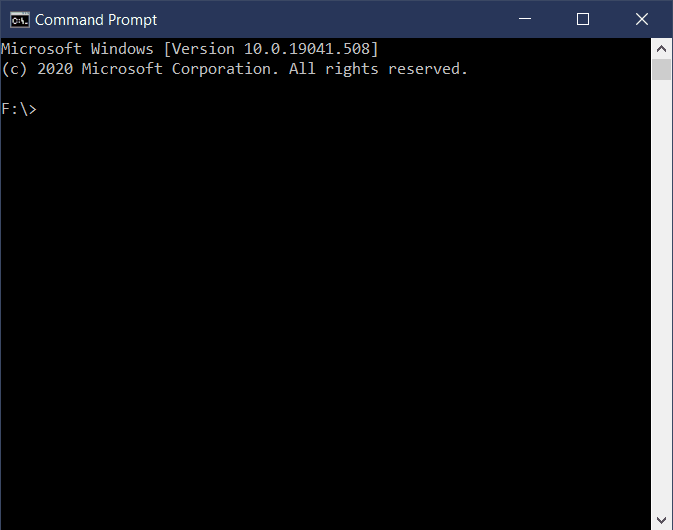

# Days in Month

Takes a month and year as integers and prints the number
of times each day occurs in the given month.

## Usage

Days in month is simple single file script, which can be used with
Python 3.6+ installed.

## Demo

